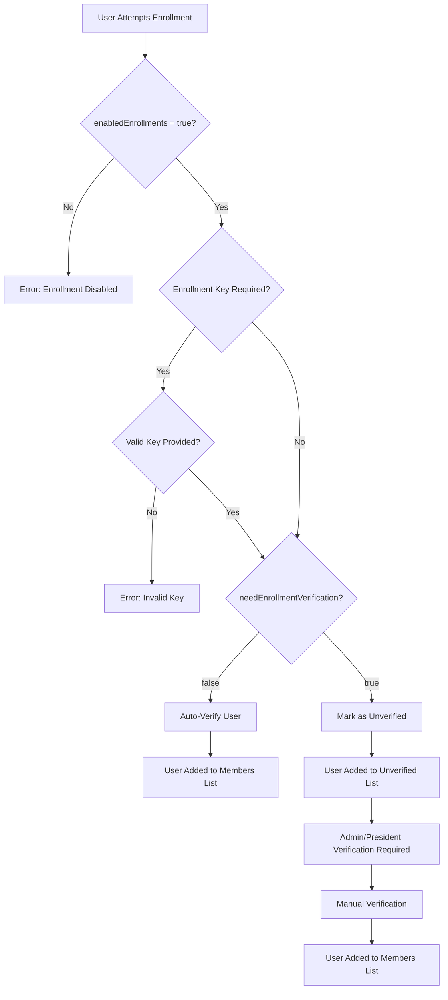

# Organization Enrollment & Verification API Documentation

## Overview
This document provides comprehensive documentation for the organization enrollment and verification system, including access levels, API endpoints, and workflow processes.

## Table of Contents
- [Access Levels & Roles](#access-levels--roles)
- [Organization Settings](#organization-settings)
- [API Endpoints](#api-endpoints)
- [Enrollment Workflow](#enrollment-workflow)
- [Verification Workflow](#verification-workflow)
- [Response Examples](#response-examples)
- [Error Handling](#error-handling)

---

## Access Levels & Roles

### User Roles Hierarchy
```
ORGANIZATION_MANAGER (Level 5) - Global access to all organizations
    ↓
PRESIDENT (Level 4) - Full organization control
    ↓
ADMIN (Level 3) - Organization management
    ↓
MODERATOR (Level 2) - Limited management
    ↓
MEMBER (Level 1) - Basic access
```

### Role Permissions

| Action | ORGANIZATION_MANAGER | PRESIDENT | ADMIN | MODERATOR | MEMBER |
|--------|---------------------|-----------|-------|-----------|---------|
| Create Organization | ✅ | ❌ | ❌ | ❌ | ❌ |
| Self Enroll | ✅ | ✅ | ✅ | ✅ | ✅ |
| View Verified Members | ✅ | ✅ | ✅ | ✅ | ✅ |
| View Unverified Members | ✅ | ✅ | ✅ | ❌ | ❌ |
| Verify Members | ✅ | ✅ | ✅ | ❌ | ❌ |
| Delete Organization | ✅ | ✅ | ❌ | ❌ | ❌ |

---

## Organization Settings

### Key Settings That Control Enrollment

| Setting | Type | Description | Default |
|---------|------|-------------|---------|
| `enabledEnrollments` | boolean | Allow self-enrollment | `true` |
| `needEnrollmentVerification` | boolean | Require manual verification | `true` |
| `isPublic` | boolean | Public visibility | `false` |
| `enrollmentKey` | string | Required key for enrollment | `null` |

### Logic Flow
```
User Wants to Enroll
    ↓
Check: enabledEnrollments = true?
    ↓ (No) → Error: "Self-enrollment disabled"
    ↓ (Yes)
Check: enrollmentKey required?
    ↓ (Yes) → Validate key
    ↓ (No/Valid)
Check: needEnrollmentVerification?
    ↓ (false) → Auto-verify user
    ↓ (true) → Mark as unverified, await manual verification
```

---

## API Endpoints

### Base URL
```
https://your-domain.com/organization/api/v1
```

### Authentication
All endpoints require JWT authentication unless specified otherwise.
```http
Authorization: Bearer <jwt-token>
```

---

## 1. Self Enrollment

### Endpoint
```http
POST /organizations/enroll
```

### Access Level
- **Any authenticated user** can attempt to enroll

### Request Body
```json
{
  "organizationId": "123",
  "enrollmentKey": "optional-key-if-required"
}
```

### Request Body Schema
| Field | Type | Required | Description |
|-------|------|----------|-------------|
| `organizationId` | string | ✅ | Target organization ID |
| `enrollmentKey` | string | ❓ | Required if organization has enrollment key |

### Response (Success)
```json
{
  "organizationId": "123",
  "name": "Tech Innovation Club",
  "type": "INSTITUTE",
  "isPublic": false,
  "enrollmentStatus": "verified", // or "pending_verification"
  "message": "Successfully enrolled and verified in organization"
}
```

### Business Logic
1. **Check `enabledEnrollments`**: Must be `true`
2. **Validate enrollment key**: If organization has key, user must provide correct key
3. **Auto-verification**: Based on `needEnrollmentVerification` setting
   - `false` → User automatically verified
   - `true` → User marked as unverified, requires manual verification
4. **Role assignment**: Self-enrolled users always get `MEMBER` role

---

## 2. Get Verified Members

### Endpoint
```http
GET /organizations/:id/members
```

### Access Level
- **Any authenticated user** with organization access

### Query Parameters
| Parameter | Type | Required | Description |
|-----------|------|----------|-------------|
| `page` | number | ❌ | Page number (default: 1) |
| `limit` | number | ❌ | Items per page (default: 20, max: 100) |

### Response
```json
{
  "members": [
    {
      "userId": "123",
      "name": "John Doe",
      "email": "john@example.com",
      "role": "MEMBER",
      "isVerified": true,
      "joinedAt": "2024-01-15T10:30:00Z"
    }
  ],
  "totalMembers": 15,
  "roleBreakdown": {
    "MEMBER": 12,
    "ADMIN": 2,
    "PRESIDENT": 1
  },
  "status": "verified_only"
}
```

---

## 3. Get Unverified Members

### Endpoint
```http
GET /organizations/:id/members/unverified
```

### Access Level
- **ADMIN** or **PRESIDENT** or **ORGANIZATION_MANAGER**

### Query Parameters
| Parameter | Type | Required | Description |
|-----------|------|----------|-------------|
| `page` | number | ❌ | Page number (default: 1) |
| `limit` | number | ❌ | Items per page (default: 20, max: 100) |

### Response
```json
{
  "unverifiedMembers": [
    {
      "userId": "456",
      "name": "Jane Smith",
      "email": "jane@example.com",
      "role": "MEMBER",
      "isVerified": false,
      "enrolledAt": "2024-01-16T14:20:00Z"
    }
  ],
  "totalUnverified": 3,
  "status": "unverified_only"
}
```

---

## 4. Verify Member

### Endpoint
```http
PUT /organizations/:id/verify
```

### Access Level
- **ADMIN** or **PRESIDENT** or **ORGANIZATION_MANAGER**

### Request Body
```json
{
  "userId": "456",
  "isVerified": true
}
```

### Request Body Schema
| Field | Type | Required | Description |
|-------|------|----------|-------------|
| `userId` | string | ✅ | User ID to verify/unverify |
| `isVerified` | boolean | ✅ | Verification status |

### Response
```json
{
  "userId": "456",
  "isVerified": true,
  "verifiedBy": "789",
  "verifiedAt": "2024-01-16T15:30:00Z",
  "user": {
    "userId": "456",
    "email": "jane@example.com",
    "firstName": "Jane",
    "lastName": "Smith"
  },
  "verifier": {
    "userId": "789",
    "firstName": "Admin",
    "lastName": "User",
    "email": "admin@example.com"
  }
}
```

### Business Logic
1. **Check enrollment status**: User must exist in organization
2. **Validate enabledEnrollments**: Must still be `true`
3. **Update verification**: Set `isVerified`, `verifiedBy`, `verifiedAt`
4. **Token refresh**: User's JWT tokens are refreshed to update access

---

## 5. Create Organization

### Endpoint
```http
POST /organizations
```

### Access Level
- **ORGANIZATION_MANAGER** only

### Request Body
```json
{
  "name": "Tech Innovation Club",
  "type": "INSTITUTE",
  "isPublic": false,
  "enrollmentKey": "tech-club-2024",
  "needEnrollmentVerification": true,
  "enabledEnrollments": true,
  "imageUrl": "https://example.com/logo.png",
  "instituteId": "456"
}
```

### Response
```json
{
  "id": "123",
  "name": "Tech Innovation Club",
  "type": "INSTITUTE",
  "isPublic": false,
  "needEnrollmentVerification": true,
  "enabledEnrollments": true,
  "imageUrl": "https://example.com/logo.png",
  "instituteId": "456"
}
```

---

## Enrollment Workflow

### Complete Enrollment Process



### Step-by-Step Process

#### 1. User Self-Enrollment
```http
POST /organizations/enroll
{
  "organizationId": "123",
  "enrollmentKey": "required-if-set"
}
```

#### 2. System Validation
- ✅ Organization exists
- ✅ `enabledEnrollments = true`
- ✅ Valid enrollment key (if required)
- ✅ User not already enrolled

#### 3. Auto-Verification Check
```javascript
if (organization.needEnrollmentVerification === false) {
  // User is automatically verified
  user.isVerified = true;
  user.verifiedAt = new Date();
} else {
  // Manual verification required
  user.isVerified = false;
  user.verifiedAt = null;
}
```

#### 4. Role Assignment
- All self-enrolled users receive `MEMBER` role
- Cannot self-assign higher roles

---

## Verification Workflow

### Admin/President Verification Process

#### 1. Get Unverified Members
```http
GET /organizations/123/members/unverified
```

#### 2. Review Pending Members
- Check member details
- Validate enrollment legitimacy

#### 3. Verify Member
```http
PUT /organizations/123/verify
{
  "userId": "456",
  "isVerified": true
}
```

#### 4. System Updates
- User marked as verified
- JWT tokens refreshed
- User appears in verified members list

---

## Response Examples

### Successful Self-Enrollment (Auto-Verified)
```json
{
  "organizationId": "123",
  "name": "Open Tech Club",
  "type": "INSTITUTE",
  "isPublic": true,
  "enrollmentStatus": "verified",
  "message": "Successfully enrolled and verified in organization"
}
```

### Successful Self-Enrollment (Pending Verification)
```json
{
  "organizationId": "123",
  "name": "Private Tech Club",
  "type": "INSTITUTE",
  "isPublic": false,
  "enrollmentStatus": "pending_verification",
  "message": "Successfully enrolled in organization. Awaiting verification."
}
```

### Verified Members List
```json
{
  "members": [
    {
      "userId": "123",
      "name": "John Doe",
      "email": "john@example.com",
      "role": "PRESIDENT",
      "isVerified": true,
      "joinedAt": "2024-01-10T08:00:00Z"
    },
    {
      "userId": "124",
      "name": "Jane Admin",
      "email": "jane@example.com",
      "role": "ADMIN",
      "isVerified": true,
      "joinedAt": "2024-01-12T10:30:00Z"
    }
  ],
  "totalMembers": 15,
  "roleBreakdown": {
    "PRESIDENT": 1,
    "ADMIN": 2,
    "MODERATOR": 3,
    "MEMBER": 9
  },
  "status": "verified_only"
}
```

### Unverified Members List
```json
{
  "unverifiedMembers": [
    {
      "userId": "456",
      "name": "New Student",
      "email": "student@example.com",
      "role": "MEMBER",
      "isVerified": false,
      "enrolledAt": "2024-01-16T14:20:00Z"
    }
  ],
  "totalUnverified": 3,
  "status": "unverified_only"
}
```

---

## Error Handling

### Common Error Responses

#### Enrollment Disabled
```json
{
  "statusCode": 400,
  "error": "Bad Request",
  "message": "Self-enrollment is disabled for this organization. Please contact an administrator."
}
```

#### Invalid Enrollment Key
```json
{
  "statusCode": 400,
  "error": "Bad Request",
  "message": "Invalid enrollment key"
}
```

#### Already Enrolled
```json
{
  "statusCode": 400,
  "error": "Bad Request",
  "message": "User is already enrolled in this organization"
}
```

#### Insufficient Permissions
```json
{
  "statusCode": 403,
  "error": "Forbidden",
  "message": "Only Organization Managers can create organizations"
}
```

#### Organization Not Found
```json
{
  "statusCode": 404,
  "error": "Not Found",
  "message": "Organization not found"
}
```

#### Verification When Enrollments Disabled
```json
{
  "statusCode": 400,
  "error": "Bad Request",
  "message": "Enrollments are disabled for this organization. Cannot verify new members."
}
```

---

## Security Considerations

### Authentication & Authorization
- All endpoints require valid JWT tokens
- Role-based access control enforced
- Organization membership validation

### Data Protection
- Sensitive user data filtered based on access level
- Organization settings protected
- Enrollment keys validated securely

### Rate Limiting
- Enrollment attempts limited to prevent abuse
- Verification actions rate limited
- API endpoints have request limits

---

## Testing Scenarios

### Scenario 1: Public Organization with Auto-Verification
```json
{
  "enabledEnrollments": true,
  "needEnrollmentVerification": false,
  "isPublic": true,
  "enrollmentKey": null
}
```
**Expected**: User enrolls and is immediately verified

### Scenario 2: Private Organization with Manual Verification
```json
{
  "enabledEnrollments": true,
  "needEnrollmentVerification": true,
  "isPublic": false,
  "enrollmentKey": "secret-key-123"
}
```
**Expected**: User enrolls with key, awaits admin verification

### Scenario 3: Enrollment Disabled
```json
{
  "enabledEnrollments": false,
  "needEnrollmentVerification": true,
  "isPublic": true,
  "enrollmentKey": null
}
```
**Expected**: Enrollment attempt fails with error

---

## Integration Examples

### Frontend Integration
```javascript
// Self-enrollment
const enrollUser = async (organizationId, enrollmentKey = null) => {
  try {
    const response = await fetch('/organizations/enroll', {
      method: 'POST',
      headers: {
        'Authorization': `Bearer ${token}`,
        'Content-Type': 'application/json'
      },
      body: JSON.stringify({
        organizationId,
        enrollmentKey
      })
    });
    
    const result = await response.json();
    
    if (result.enrollmentStatus === 'verified') {
      // User is immediately verified
      showSuccess('Successfully joined organization!');
    } else {
      // Manual verification required
      showInfo('Enrollment submitted. Awaiting admin approval.');
    }
  } catch (error) {
    showError('Enrollment failed: ' + error.message);
  }
};

// Get unverified members (Admin only)
const getUnverifiedMembers = async (organizationId) => {
  try {
    const response = await fetch(`/organizations/${organizationId}/members/unverified`, {
      headers: {
        'Authorization': `Bearer ${token}`
      }
    });
    
    const data = await response.json();
    return data.unverifiedMembers;
  } catch (error) {
    console.error('Failed to fetch unverified members:', error);
  }
};

// Verify member (Admin/President only)
const verifyMember = async (organizationId, userId, isVerified = true) => {
  try {
    const response = await fetch(`/organizations/${organizationId}/verify`, {
      method: 'PUT',
      headers: {
        'Authorization': `Bearer ${token}`,
        'Content-Type': 'application/json'
      },
      body: JSON.stringify({
        userId,
        isVerified
      })
    });
    
    const result = await response.json();
    showSuccess(`Member ${isVerified ? 'verified' : 'unverified'} successfully!`);
    return result;
  } catch (error) {
    showError('Verification failed: ' + error.message);
  }
};
```

---

## Changelog

### Version 1.0 (Current)
- ✅ Self-enrollment API
- ✅ Member verification system
- ✅ Separate verified/unverified member endpoints
- ✅ Organization manager access controls
- ✅ Enhanced enrollment validation
- ✅ Auto-verification based on organization settings

### Future Enhancements
- 🔄 Bulk member verification
- 🔄 Enrollment approval workflow
- 🔄 Email notifications for verification
- 🔄 Member invitation system

---

*Last Updated: September 7, 2025*
*API Version: 1.0*
